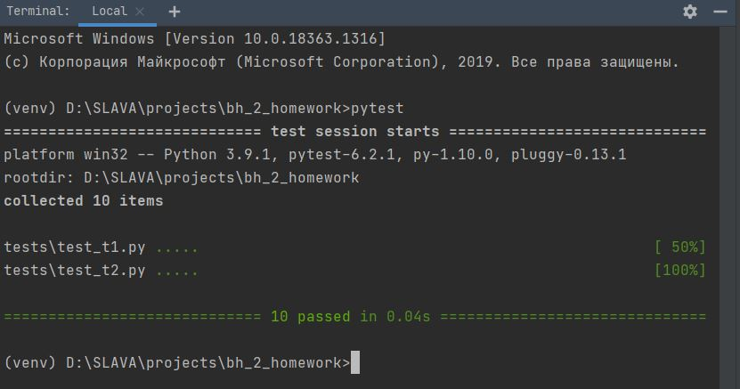
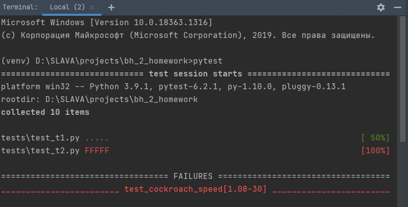
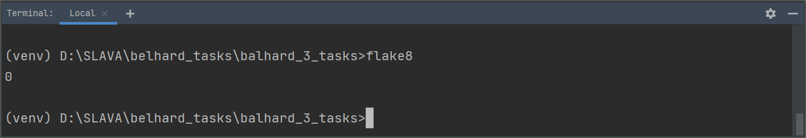
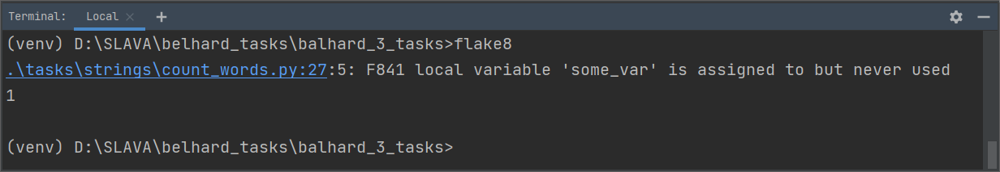

# Занятие 3. Простейшие типы данных. Строки. Операторы

Все задания находятся в директории tasks.
В каждом файле новое задание.

## Домашние задания

**Deadline оговаривается на занятии**

**Важно: решения должны быть оформлены в соответствии с [PEP8](https://www.python.org/dev/peps/pep-0008/)**

Порядок выполнения домашнего задания:
1. Делаем fork репозитория с заданием к себе на аккаунт
2. На странице своего репозитория нажимаем кнопку "code" и копируем адрес репозитория
3. Выполняем git clone <ссылка на ваш репозиторий>
4. Создаем проект в директории склонированного репозитория
5. Выполняем задания и пушим результат на github
6. Отправляем ссылку на проверку в Telegram/Viber
7. Отправляем screenshot со всеми пройденными тестами PyTest
8. Отправляем screenshot со всеми пройденными тестами Flake8 

## Как работать с Pytest

Для того, чтобы тестировать свой код по мере выполнения заданий, необходимо установить модуль pytest, 
который выполняет unit-тесты.

Тесты именуются следующим образом:

    test_[название-задания].py

Если тест для задания пройден успешно, то он отображается с одним или несколькими символами ".":

    tests\test_some.py .....

Если какой-то тест выполняется с ошибкой, то он помечается символом "F":

    tests\test_some.py ..F..

Для работы необходимо установить Pytest с помощью pip. Для этого в командной строке или терминале необходимо выполнить команду:

    pip install pytest

Если вы находитесь в директории проекта, то можно установить также с помощью команды:

    pip install -r requirements.txt

Для прогона всех тестов, выполняем команду (нужно находиться в папке проекта):

    pytest

Для прогона теста к конкретному заданию, выполняем команду:

    pytest tests/[папка-с-заданиями]/test_[название-задания].py

Для прогона теста до первой ошибки, выполняем команду:

    pytest -x

Пример успешно пройденных тестов:

Пример прогона, когда некоторые тесты завершились с ошибкой:

## Как работать с flake8

**flake8 проверяет, что ваш код соответствует PEP8**

[Расшифровки ошибок](https://www.flake8rules.com/)

Для работы необходимо установить flake8 с помощью pip. Для этого в командной строке или терминале необходимо выполнить команду:

    pip install flake8

Если вы находитесь в директории проекта, то можно установить также с помощью команды:

    pip install -r requirements.txt

Пример успешно пройденных тестов:

Пример прогона, когда некоторые тесты завершились с ошибкой:

